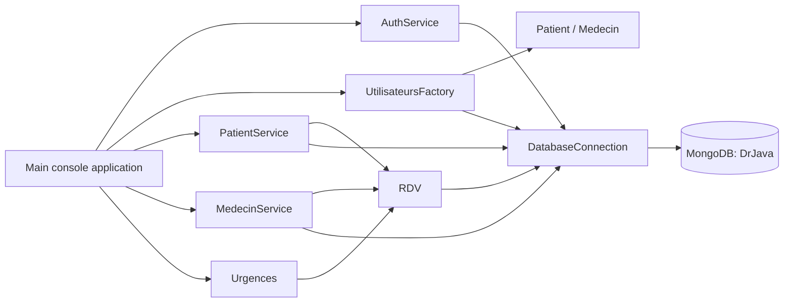
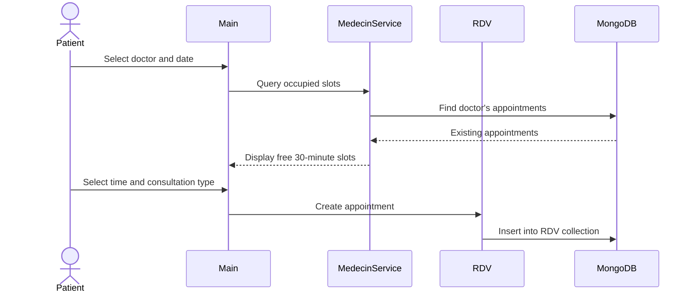

# Dr. Java — Hospital Management CLI


Dr. Java is a Java 17 command-line application for managing patients, doctors, appointments, emergencies, consultation reports, and prescribed treatments. It uses MongoDB for persistence and exposes a role-specific French-language workflow for patients and doctors.

The project was developed for an ESEO software-development course and brings together object-oriented design, data structures, persistence, modelling, documentation, and integration testing.

> [!IMPORTANT]
> This repository is an educational prototype. It stores passwords as plain text, uses a live MongoDB database during tests, and currently has a mismatch between the appointment field names written and read by the application. Review [Known limitations](#known-limitations) before using it with real data.

## Features

### Patient workflow

- Authenticate with an email address and password.
- Find a doctor by surname.
- Display a doctor's available 30-minute slots.
- Create, list, and cancel appointments.
- Request an emergency appointment from the earliest free slot found over the next seven days.
- Select a symptom with an associated priority level.

### Doctor workflow

- Display the current day's schedule.
- Add a written consultation report to an appointment.
- Select and save a prescribed treatment.
- View a patient's consultation history by email address.

### Technical capabilities

- Role-based object creation through a user factory.
- MongoDB-backed `User` and `RDV` collections.
- Parsing of per-doctor consultation schedules.
- Generation of configurable time slots from schedule ranges.
- Javadoc generated in `doc/`.
- JUnit 5 unit and database-integration tests.

## Architecture



### Main packages

| Package | Responsibility |
| --- | --- |
| `fr.eseo.e3e.devlogiciel.projetjava` | Application entry point and interactive menus. |
| `database` | Loads `MONGO_URI` and opens the `DrJava` MongoDB database. |
| `users.model` | Base user model plus `Patient` and `Medecin` specialisations. |
| `users.factory` | Rebuilds typed users from MongoDB documents. |
| `users.service` | Authentication and patient/doctor queries. |
| `consultation.model` | Appointments, emergencies, symptoms, and treatments. |
| `consultation.service` | Schedule parsing and time-slot generation. |

## Data model

The code expects a database named `DrJava` with two collections.

### `User`

| Field | Type | Notes |
| --- | --- | --- |
| `_id` | `ObjectId` | MongoDB identifier. |
| `Prénom`, `Nom` | String | User identity. |
| `Email` | String | Login and relationship key. |
| `Password` | String | Currently compared as plain text; development use only. |
| `Date of birth` | BSON date | Converted to `LocalDate`. |
| `Role` | String | `Patient` or `Médecin`. |
| `horairesConsultation` | Document | Doctor-only map of days to ranges such as `09:00-12:00`. |

### `RDV`

An appointment links a patient and doctor by email and stores its date, start and end times, type, report, and treatment. New appointments are assigned a MongoDB `ObjectId` after insertion.

## Requirements

- JDK 17
- IntelliJ IDEA, recommended because the repository includes its module and library configuration
- A reachable MongoDB deployment
- Network access on first import so IntelliJ can resolve the configured libraries

The project configuration references:

- MongoDB Java driver `3.12.14`
- `dotenv-java` `3.2.0`
- JUnit Jupiter `5.9.2`

The repository does not currently include a Maven or Gradle build descriptor.

## Setup

1. Clone and enter the repository:

   ```bash
   git clone https://github.com/BBBsouheil/Hospital-Management-Java.git
   cd Hospital-Management-Java
   ```

2. Open the repository root in IntelliJ IDEA and select JDK 17 for the project.

3. Copy `src/data.env.example` to `src/data.env`, then provide a development MongoDB connection string:

   ```dotenv
   MONGO_URI=mongodb://localhost:27017
   ```

   The application always selects the `DrJava` database. Do not commit a real username, password, or cloud connection string.

4. Create the `User` collection and seed at least one patient and one doctor using the schema above. The current authentication implementation requires the stored development password to match the entered text exactly.

5. Run `fr.eseo.e3e.devlogiciel.projetjava.Main` from IntelliJ.

The application starts with an email/password prompt and then displays the menu associated with the user's role.

## Appointment flow



Emergency booking scans all doctors and standard half-hour slots from 09:00 to 16:30 over a seven-day window, then selects the earliest available date and time.

## Tests

Tests live under `Tests/` and can be run with IntelliJ's JUnit runner. They cover:

- schedule-range parsing;
- successful and unsuccessful authentication;
- appointment insertion, update, and deletion;
- doctor schedule lookup and consultation-report updates.

> [!CAUTION]
> The tests connect to the database configured by `src/data.env`. `MedecinServiceTest` deletes every document in both the `User` and `RDV` collections during setup. Use a disposable test database only—never a shared, staging, or production database.

## Repository structure

```text
Hospital-Management-Java/
├── src/
│   ├── data.env.example          Safe connection-string template
│   └── fr/eseo/e3e/devlogiciel/projetjava/
│       ├── Main.java
│       ├── consultation/
│       │   ├── model/
│       │   └── service/
│       ├── database/
│       └── users/
│           ├── factory/
│           ├── model/
│           └── service/
├── Tests/                         JUnit tests
├── doc/                           Generated Javadoc
├── Projet_Java.iml               IntelliJ module definition
├── PROJET_GESTION_HOPITAL_*.pdf  Project report
├── BERGER_BENBOUBAKER_SLIDES.pdf Presentation slides
└── LICENSE
```

## Known limitations

- Passwords are stored and compared in plain text; there is no hashing, salting, or secure credential lifecycle.
- `src/data.env` was previously committed and may remain accessible in Git history. Any credential it contained should be considered exposed until it is rotated or disabled.
- `RDV.setRdv` writes `heureDebut` and `heureFin`, while the read paths and tests expect `debut` and `fin`. Appointments created by the current CLI therefore require a schema fix before they can be read consistently.
- The `RDV` constructor ignores the supplied report and treatment values and resets both fields to empty strings.
- A selected appointment time is checked for being in the future, but it is not validated against the displayed availability before insertion.
- Symptom priority is displayed but is not used to order emergency requests; emergency selection is based only on the earliest free date and time.
- Invalid login credentials raise an exception that is not caught by the main menu, so the application can terminate instead of prompting again.
- The project relies on IDE metadata rather than a reproducible Maven or Gradle build.
- Tests mix unit and live-database integration behaviour and are not isolated from the configured database.

## Roadmap

- Add Maven or Gradle with a single, pinned dependency set.
- Introduce a dedicated test database and automatic fixtures.
- Hash passwords with a password-specific algorithm and remove secrets from Git history.
- Unify the appointment field names and add schema validation.
- Enforce doctor schedules and collision checks when booking.
- Use symptom priority in emergency triage and document the scheduling policy.
- Add input validation, graceful exception handling, and a clean application shutdown path.
- Separate persistence repositories from domain models and console presentation.
- Add continuous integration for compilation, tests, and Javadoc generation.

## Documentation

Generated API documentation is available in `doc/index.html`. The repository also includes the original project report and presentation slides for additional academic context.

## License

Distributed under the MIT License. See [`LICENSE`](LICENSE).
